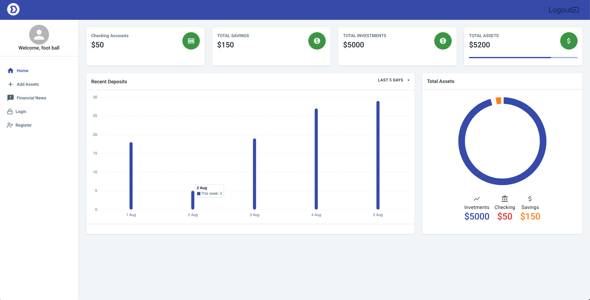

<h1 align="center"> Marbles </h1>

<h2><u>Overview:</u><h2>

<h4>Marbles is a simple tool that allows you to view and track your assets.</h4>

 

<h2><u>Tools used in the project:</u></h3>
<h3>Languages:</h3>
<ul>
    <li>HTML</li>
    <li>CSS</li>
    <li>JavaScript</li>
</ul>

Other Tools:

<ul>
    <li>React</li>
    <li>Redux</li>
    <li>Material-UI</li>
    <li>JSON Web Tokens (authentication)</li>
    <li>PostgreSQL(database)</li>
</ul>

 

<h3><u>Base Objectives:</u></h3>
<ul>
    <li>Dashboard view</li>
    <li>Page to view current financial news</li>
    <li>Ability to add assets</li>
    <li>Track each asset class individually</li>
</ul>

 

<h2><u>Stretch Goals </u></h2>
<ul>
    <li>Allow user to add expenses and track them</li>
    <li>Ability to change profile name/password/email etc.</li>
</ul>

 

<h2><u>Challenges & Solutions:</u><h2>
<h3>Some of the biggest challenges I faced with this project build included:</h2>

<b>Challenge: </b>
   
<b>Solution: </b>

<b>Challenge: Working with a React template</b>
   
<b>Solution:  Working with a template for the first time was a big challenge. I spent many hours renaming and reworking the file structure and layout unitl it met my needs. 
</b>

<b>Challenge: </b>
   
<b>Solution:  </b>

 
