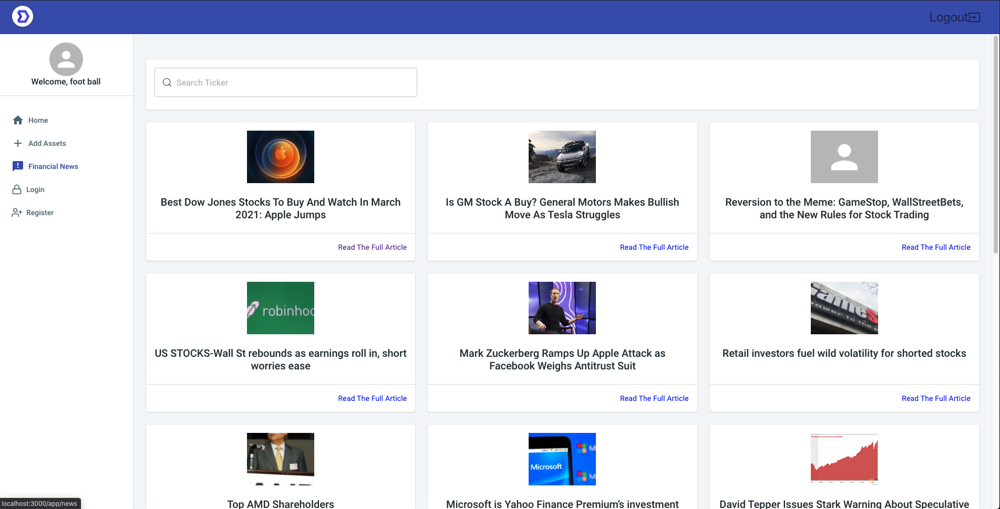

<h1 align="center"> Marbles </h1>

<h2><u>Overview:</u><h2>

<h4>Marbles is a simple tool that allows you to view and track your assets.</h4>

</br>




<h2><u>Tools used in the project:</u></h3>
<h3>Languages:</h3>
<ul>
    <li>HTML</li>
    <li>CSS</li>
    <li>JavaScript</li>
</ul>

Other Tools:

<ul>
    <li>React</li>
    <li>Redux</li>
    <li>Material-UI</li>
    <li>JSON Web Tokens (authentication)</li>
    <li>PostgreSQL(database)</li>
</ul>

</br>

<h3><u>Base Objectives:</u></h3>
<ul>
    <li>Dashboard view</li>
    <li>Page to view current financial news</li>
    <li>Ability to add assets</li>
    <li>Track each asset class individually</li>
</ul>


</br>

<h2><u>Stretch Goals </u></h2>
<ul>
    <li>Allow user to add expenses and track them</li>
    <li>Ability to change profile name/password/email etc.</li>
</ul>

</br>

<h2><u>Challenges & Solutions:</u><h2>
<h3>Some of the biggest challenges I faced with this project build included:</h2>

<b>Challenge: Working Solo </b>
<br/> <br/>
<b>Solution: I wanted to build this project on my own to push myself to better understand the technologies covered at DigitalCrafts. </b>

<b>Challenge: Working with a React template</b>
<br/> <br/>
<b>Solution:  Working with a template for the first time was a big challenge. I spent many hours renaming and reworking the file structure and layout unitl it met my needs. 
</b>

<b>Challenge: Keeping track of all documentation</b>
<br/> <br/>
<b>Solution: I decided to create a spread sheet to track all the links I needed to reference. </b>

</br>

<h2><u>Code Snippets:</u></h2>

<h4>Using Redux to add assets from database</h4>

```
const AddAssetsView = () => {
  const classes = useStyles();
  // const [customers] = useState(data);
  const navigate = useNavigate();
  const dispatch = useDispatch();
  const [checking, setChecking] = useState('');
  const [savings, setSavings] = useState('');
  const [investments, setInvestments] = useState('');
  const userId = useSelector((state) => state.auth.id);

  

  const handleSubmit = (e) => {
    
    e.preventDefault();

    // call action
    //pass the email address and password to our action
    //dispatch(sinup(), cb)

    dispatch(setAssets({
      userId: userId,
      checking: checking,
      savings: savings,
      investments: investments
    }, () =>{
      console.log('pushing to another page');
      navigate('/app/dashboard', { replace: true });
    }))


  }
```
